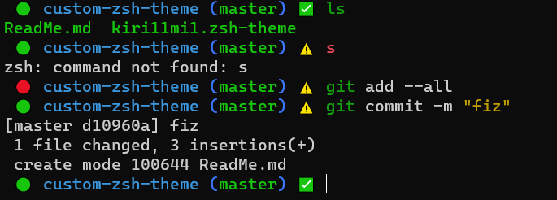

# Кастомная тема для oh-my-zsh

## Внешний вид


## ⚠️ Требования

* Система Linux/macOS
* Установленный фреймворк [oh-my-zsh](https://ohmyz.sh/)

## ⬇️ Установка

1. Склонируйте репозиторий:
```
git clone git@github.com:kiri11-mi1/my-zsh-theme.git
```

2. Скопируйте файл темы в папку со всеми темами zsh:
```
cp kiri11mi1.zsh-theme ~/.oh-my-zsh/themes/
```

3. Поменяйте тему в файле `~/.zshrc`
```
nano ~/.zshrc
```


4. Активируйте новую тему
```
source ~/.zshrc
```